  <picture>
    <source media="(prefers-color-scheme: dark) and (max-width: 480px)" srcset="public/hero-dark-mobile.svg">
    <source media="(prefers-color-scheme: dark) and (max-width: 640px)" srcset="public/hero-dark-tablet.svg">
    <source media="(prefers-color-scheme: dark)" srcset="public/hero-dark.svg">
    <source media="(max-width: 480px)" srcset="public/hero-light-mobile.svg">
    <source media="(max-width: 640px)" srcset="public/hero-light-tablet.svg">
    
  </picture>
    

&nbsp;
&nbsp;
&nbsp;
&nbsp;

---

<picture>
  <source media="(prefers-color-scheme: dark) and (max-width: 480px)" srcset="public/section-about-dark-mobile.svg">
  <source media="(prefers-color-scheme: dark) and (max-width: 640px)" srcset="public/section-about-dark-tablet.svg">
  <source media="(prefers-color-scheme: dark)" srcset="public/section-about-dark.svg">
  <source media="(max-width: 480px)" srcset="public/section-about-light-mobile.svg">
  <source media="(max-width: 640px)" srcset="public/section-about-light-tablet.svg">
  
</picture>

Frontend Vue.js / Nuxt.js Engineer with **8+ years** of experience delivering responsive, high-performance web applications. Deep expertise in **Vue.js (2/3)** and **Nuxt.js (2/3/4)** with TypeScript, SSR, Composition API, Pinia, Vuex, GraphQL, REST API, and i18n. Delivered multilingual e-commerce platforms, SaaS dashboards, and headless CMS-driven sites for clients across **Czech Republic · UK · US · Ukraine**. Experienced in Agile cross-functional teams with a track record of mentoring junior developers.

> 🟢 **Seeking full-time or contract remote opportunities** with Ukrainian and EU-based companies.

---

<picture>
  <source media="(prefers-color-scheme: dark) and (max-width: 480px)" srcset="public/section-skills-dark-mobile.svg">
  <source media="(prefers-color-scheme: dark) and (max-width: 640px)" srcset="public/section-skills-dark-tablet.svg">
  <source media="(prefers-color-scheme: dark)" srcset="public/section-skills-dark.svg">
  <source media="(max-width: 480px)" srcset="public/section-skills-light-mobile.svg">
  <source media="(max-width: 640px)" srcset="public/section-skills-light-tablet.svg">
  
</picture>

**Core Frontend**

**State & Routing**

**Styling**

**API & Integrations**

-21759B?style=flat-square&logo=wordpress&logoColor=white)

**Build & DevOps**

**Mobile / Additional**

**Testing**

**Backend Familiarity**

---

<picture>
  <source media="(prefers-color-scheme: dark) and (max-width: 480px)" srcset="public/section-experience-dark-mobile.svg">
  <source media="(prefers-color-scheme: dark) and (max-width: 640px)" srcset="public/section-experience-dark-tablet.svg">
  <source media="(prefers-color-scheme: dark)" srcset="public/section-experience-dark.svg">
  <source media="(max-width: 480px)" srcset="public/section-experience-light-mobile.svg">
  <source media="(max-width: 640px)" srcset="public/section-experience-light-tablet.svg">
  
</picture>

### 🟢 Lambda-dev — Frontend Engineer

`Sep 2023 – Present` · **2+ years**

<strong>E-commerce Platform for Organic Products (Czech Republic)</strong>

 

Multilingual Czech e-commerce platform for a retail brand specializing in organic cosmetics and supplements. Nuxt.js frontend consuming GraphQL data from a Symfony/PHP backend.

- Integrated Google Tag Manager to support analytics and marketing tracking workflows
- Built and maintained Vue.js components and Vuex state management across a large multilingual codebase
- Implemented GDPR-compliant cookie consent bar and rebuilt the interactive store locator map component
- Delivered responsive, cross-device layouts aligned with design system guidelines

**Stack:** `Nuxt.js` `Vue.js` `Vuex` `JavaScript` `Less` `GraphQL` `Symfony` `PHP` `MariaDB` `Docker` `Git` `Figma`

<strong>E-commerce Platform for Appliances and Spare Parts (Czech Republic)</strong>

 

Wholesale web app for a Czech appliance parts brand with rich interactive features and a multi-region customer base.

- Configured global styling system and responsive layout architecture from the ground up using Vue.js and Less
- Developed interactive Vue.js features: store locator map, embedded chat, video player, and community forum
- Connected frontend to backend via GraphQL APIs; implemented Google Analytics and GDPR cookie consent

**Stack:** `Nuxt.js` `Vue.js` `Vuex` `JavaScript` `Less` `GraphQL` `Symfony` `PHP` `MariaDB` `Docker` `Git` `Figma`

<strong>Organic Product Distribution Landing Page</strong>

 

Multilingual marketing landing page for a Czech organic food and cosmetics distributor, built from scratch.

- Scaffolded Nuxt.js project from scratch: ESLint configuration, plugin setup, and Nuxt module integration
- Applied brand-compliant global styles; built reusable, responsive Vue.js components
- Integrated i18n for multilingual content delivery targeting international audiences

**Stack:** `Nuxt.js` `Vue.js` `TypeScript` `SCSS` `TailwindCSS` `i18n` `Git` `Figma`

<strong>Modular SaaS Web Platform for Business Operations</strong>

 

Multilingual B2B website for a Czech enterprise software provider presenting a modular SaaS platform covering e-commerce, retail, logistics, HR, and content management.

- Configured Nuxt.js 4 project architecture: linting, plugins, Nuxt modules, and API proxy setup
- Built a responsive Vue.js component library presenting each SaaS module with clear visual segmentation
- Implemented i18n multilingual support and REST API integration
- Delivered redesigned admin panel with dashboard and widget components using Pinia and TypeScript

**Stack:** `Nuxt.js 4` `Vue.js` `TypeScript` `SCSS` `TailwindCSS` `Pinia` `i18n` `Symfony` `PHP` `MariaDB` `Docker` `Git` `Figma`

---

### EPAM Systems — Mobile Software Engineer

`Feb 2022 – Mar 2023` · **1 year 2 months**

<strong>Native Mobile Applications for Retail Loyalty Integration</strong>

 

iOS and Android loyalty app for an international retail brand, with deep linking and analytics integration.

- Developed card linking UI with real-time validation and camera-based scanning functionality
- Implemented platform-specific deep linking: universal links (iOS) and applinks (Android)
- Integrated Adobe Analytics for end-to-end user journey tracking across the purchase flow
- Collaborated across a cross-functional Agile team (Dev, BA, QA, OPS, PM)

**Stack:** `React Native` `Redux` `TypeScript` `Jest` `Xcode` `Android Studio` `Flipper` `Git`

<strong>Native Mobile App &amp; Admin Panel — Blood Donation Platform (Ukraine)</strong>

 

Cross-platform mobile apps (iOS/Android) and an internal admin panel for a nationwide Ukrainian blood donation platform.

- Delivered new functional screens and reusable UI components for iOS and Android
- Refactored and resolved bugs across the React and React Native mobile codebase
- Implemented data table sorting and content organization features in the React admin panel
- **Mentored junior developers** on codebase standards and best practices within a 10-person development team

**Stack:** `React` `React Native` `Redux Saga` `TypeScript` `Jest` `MySQL` `Xcode` `Android Studio` `Flipper` `Git`

---

### Hex Digital — Full-Stack Developer

`Oct 2018 – Sep 2021` · **2 years 11 months**

Delivered **6 Nuxt.js / Vue.js projects** for US and UK clients across academic, nonprofit, and hospitality sectors, using headless WordPress with REST API content delivery.

<strong>Academic &amp; Research Information Platform (US)</strong>

 

Content-rich website for a US molecular biology research department, built with Nuxt.js 2 and headless WordPress.

- Developed Nuxt.js 2 frontend with Vuex state management and dynamic REST API-driven content rendering
- Built reusable SCSS/inuitcss components covering faculty profiles, lab groups, news, and academic events
- Optimized for SEO, accessibility, and mobile-first responsiveness

**Stack:** `Nuxt.js 2` `Vue.js` `Vuex` `JavaScript` `SCSS` `inuitcss` `Headless WordPress` `REST API` `MariaDB` `Zeplin` `Git`

<strong>Nonprofit &amp; Cultural Collaboration Web App — OKRE (UK)</strong>

 

Dynamic content platform connecting entertainment industry professionals with researchers.

- Architected Nuxt.js 2 frontend with REST API-driven dynamic routes and animated Vue.js components
- Managed application state with Vuex; implemented mobile-first SCSS/inuitcss styling system
- Delivered modular, editorial-friendly component architecture aligned with design specs from Zeplin

**Stack:** `Nuxt.js 2` `Vue.js` `Vuex` `JavaScript` `SCSS` `inuitcss` `Headless WordPress` `REST API` `MariaDB` `Zeplin` `Git`

<strong>Hospitality Marketing Web Applications — 4 Projects (US &amp; UK)</strong>

 

Four marketing websites for US and UK hospitality brands — a Japanese robatayaki restaurant, a fine dining venue, a global QSR chain, and a sushi/bento brand — powered by headless WordPress via REST API.

- Built Atomic Design-driven Vue.js component libraries reflecting distinct brand identities across all four projects
- Implemented location-based filtering, multilingual support, and a Google Maps API "Find Closest Restaurant" feature
- Applied scalable SCSS/inuitcss global style systems; optimized each site for SEO, accessibility, and performance
- Developed mobile-first responsive layouts for multi-market audiences across US and UK

**Stack:** `Nuxt.js 2` `Vue.js` `Vuex` `JavaScript` `SCSS` `inuitcss` `Headless WordPress` `REST API` `Google Maps API` `MariaDB` `Zeplin` `Git`

---

### SplineStudio — WordPress Developer

`Jun 2017 – Oct 2018` · **1 year 4 months**

Delivered **4 custom WordPress themes** for clients across travel, entertainment, student media, and B2B real estate advisory sectors. Each project featured multilingual support (WPML), SEO optimization, mobile-first responsive design, and custom CMS workflows using ACF, custom post types, PHP, SCSS, and jQuery.

---

<picture>
  <source media="(prefers-color-scheme: dark) and (max-width: 480px)" srcset="public/section-education-dark-mobile.svg">
  <source media="(prefers-color-scheme: dark) and (max-width: 640px)" srcset="public/section-education-dark-tablet.svg">
  <source media="(prefers-color-scheme: dark)" srcset="public/section-education-dark.svg">
  <source media="(max-width: 480px)" srcset="public/section-education-light-mobile.svg">
  <source media="(max-width: 640px)" srcset="public/section-education-light-tablet.svg">
  
</picture>

| Degree | Field | University | Years |
|---|---|---|---|
| **Master's** | Computer Science | University of Customs and Finance | 2017 – 2019 |
| **Bachelor's** | Computer Science | University of Customs and Finance | 2013 – 2017 |

---

## Languages

&nbsp;

---

<picture>
  <source media="(prefers-color-scheme: dark) and (max-width: 480px)" srcset="public/section-contact-dark-mobile.svg">
  <source media="(prefers-color-scheme: dark) and (max-width: 640px)" srcset="public/section-contact-dark-tablet.svg">
  <source media="(prefers-color-scheme: dark)" srcset="public/section-contact-dark.svg">
  <source media="(max-width: 480px)" srcset="public/section-contact-light-mobile.svg">
  <source media="(max-width: 640px)" srcset="public/section-contact-light-tablet.svg">
  
</picture>

**Open to remote opportunities — full-time or contract**

&nbsp;
&nbsp;

Ready to start? Let's connect.

